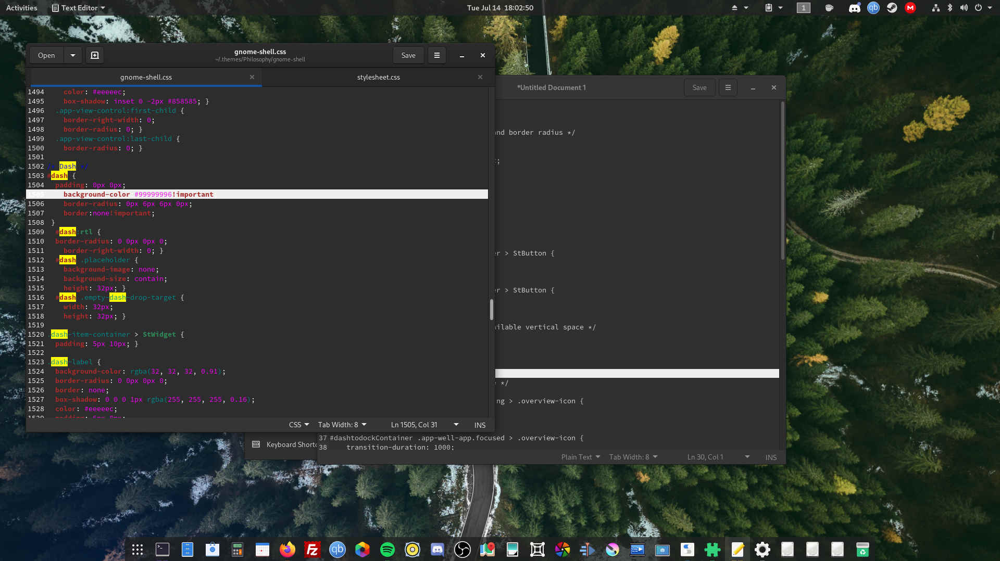

# Philosophy
A dark GNOME shell theme based on Black Maia. It features a few performance improvements and a more pleasing design. Uses the Cantarell font.

## Dependencies
> GNOME 3.36 or later

> Dash to dock gnome extension - https://extensions.gnome.org/extension/307/dash-to-dock/

> User Themes gnome extension - https://extensions.gnome.org/extension/19/user-themes/

> cantarell-fonts

> Gnome Tweaks
## Installation
> $ git clone https://github.com/HonusDaniel/Philosophy

> $ cp -r Philosophy/ ~/.themes

